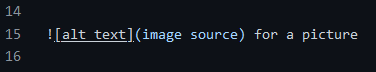

# One hashtag for a main header

Testing repository for Information Security

## Two hashtags for a sub-header

Common text for paragraph.

        Four tabs for code stuff
   
And this is a common paragraph again.

Double enters for a new paragraph.

[[This is a link](link source)](https://github.com/heipaipai)

This is a picture

